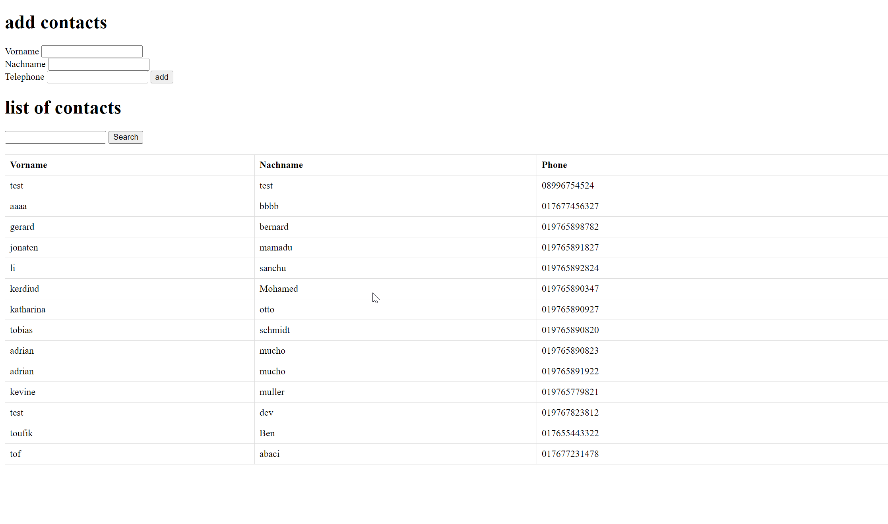

# A simple application search contacts in telephone directory giving first_name or last_name as T9 model <br>




# requirements  
git <br> 
php 8.0.^ <br> 


# Installations 

```
git clone https://github.com/toof06/test_t9.git
```

```
cd test_t9
```

```
composer install
```

```
edit the file db/DatabaseConnection.php with your database informations the default are "localhost"; username ="root"; password = "";

```
php -S localhost:7000 -d "error_reporting=E_ALL && E_STRICT"
```

##### example test project 
Project: 

Create a phone directory with a search function similar to T9 on mobile phones. Only the first name, last name, and phone number are saved for each entry. To perform a search, the user enters a sequence of numbers. As a result, all entries are displayed whose first names or last names begin with the letters derived from the numbers
(that is, the letters that are on the keypad of a mobile phone above the numbers, the search for 688 corresponds, for example, to OTTo and NUTzer, and 724 to SCHmidt and RAHmen). The search should provide results quickly, even with >1 million data records.

Structure:

Create a suitable database structure (using SQLite or MySQL, attach the configuration script or dump of the initial database with table creation instructions).
Create a demonstration application with these two use cases:
- Entering a data record using a form (without user authentication)
- Querying the database by entering a number (standard HTML form) and outputting the results (standard HTML table)
If you have already worked with unit tests: Create the unit tests that you find useful.

NB:

The solution should be minimal and easy to understand.
Avoid CSS, JavaScript, unnecessary meta tags, frameworks, etc. Code for PHP version 7.1 or higher and error_reporting = E_ALL|E_STRICT.
Program in an object-oriented way and structure your code cleanly and clearly. Use meaningful and descriptive names for all identifiers.
Document parameters and return values in PHPDoc style and modify existing comments for better understanding if necessary.

